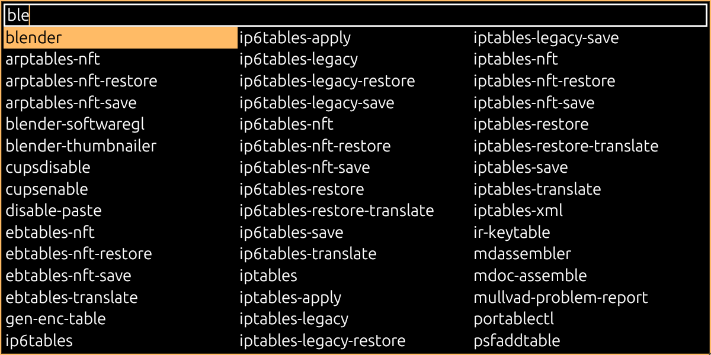

# linch 0.4.0
Cross-desktop application launcher made with ~~iced~~ egui

## Features
  * Launch apps or run commands on X11 and Wayland
    * Desktop entries also show icons
  * Dmenu replacement
    * Linking `linch <flags> dmenu` directly to `dmenu` should work for basic applications
    * Does NOT currently support dmenu's cli flags. They will either have to be discarded or converted to linch equivalents.
  * Search with regular expressions or plain text
  * Easy custom themes
  * Pure Rust, very portable.

## Usage
`linch bin` for running binaries directly from `PATH`

`linch app` for running [desktop applications](https://wiki.archlinux.org/title/Desktop_entries)

`linch dmenu` for piping custom choices through stdin dmenu-style

`linch help` for additional information

You may export `WINIT_UNIX_BACKEND=x11` to force Linch to run in X11 mode.
## Goals for 1.0
  * Finalize desktop application support
    * Descriptions?
    * Actions?
  * Possibly more CLI options
  * Dmenu 1:1 compatibility?
  * I should probably add a scroll bar.

## Known issues
  * Application does not stay always-on-top in Wayland
    * This is a current limitation from [winit](https://github.com/rust-windowing/winit) with [no current workaround](https://github.com/rust-windowing/winit/issues/2435)
  * Hardcoded for Linux
    * While there's nothing (that I know of) stopping Linch from running on Windows or MacOS, there's not much of an incentive support them when they already have their own built-in launchers.
    * Hypothetically, `linch bin` might work out-of-the-box if you're so determined. All it does is search `PATH`.

## Installation
Compiled binaries are provided on the [releases tab](https://github.com/Beinsezii/linch/releases)

If you already have [Rust installed](https://rustup.rs/), you can build the latest release with

`cargo install --git https://github.com/Beinsezii/linch.git --tag 0.1.0`

You may omit the `--tag` flag if you follow the rebel path and want the latest possibly unstable build.

It's recommended you add the downloaded binary or cargo install dir to your `PATH` for ease of use.

## F.A.Q.
Question|Answer
---|---
Why is it called `linch`?|"**I**ced **L**au**nch**er". I originally tried to write it with [iced](https://github.com/iced-rs/iced) but due to [multiple](https://github.com/iced-rs/iced/issues/34) [issues](https://github.com/iced-rs/iced/issues/1113) I rewrote everything in [egui](https://github.com/emilk/egui) for the time being and `lench` just sounds stupid.
